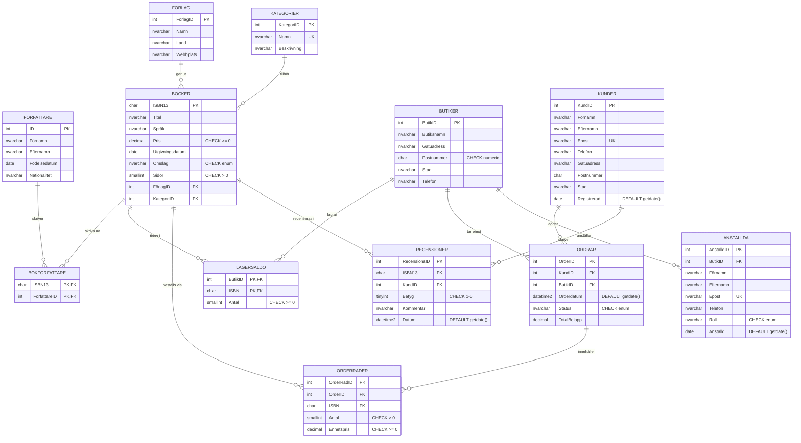

# ER-Diagram – Bokhandel

**Tahar Guemir – ITHS Distans**  
**12 tabeller** (11 entiteter + 1 junction) | **3 stored procedures** | **2 vyer** | **3NF-normaliserad**

---

## Entity-Relationship Diagram (Mermaid)

---

## Förklaring av notation

| Symbol | Betydelse |
|--------|-----------|
| **PK** | Primärnyckel (Primary Key) |
| **FK** | Främmande nyckel (Foreign Key) |
| **UK** | Unik nyckel (Unique Key) |
| `||--o{` | En-till-många relation (1:N) |
| **CHECK** | Integritetsvillkor (constraints) |
| **DEFAULT** | Förvalt värde |

---

## Tabellöversikt

### Entitetstabeller (11 st)

| # | Tabell | Primärnyckel | Beskrivning | Tillval |
|---|--------|--------------|-------------|---------|
| 1 | **Förlag** | FörlagID (IDENTITY) | Bokförlag med land och webbplats | Extra |
| 2 | **Kategorier** | KategoriID (IDENTITY) | Bokgenrer med unikt namn | Extra |
| 3 | **Författare** | ID (IDENTITY) | Persondata: namn, födelse, nationalitet | G-krav |
| 4 | **Böcker** | ISBN13 (CHAR(13), CHECK) | Bokinformation: titel, pris, datum, omslag | G-krav |
| 5 | **Butiker** | ButikID (IDENTITY) | Butiker med fullständig adress | G-krav |
| 6 | **Kunder** | KundID (IDENTITY) | Kundregister med kontaktuppgifter | Extra |
| 7 | **Ordrar** | OrderID (IDENTITY) | Orderheader med status och datum | Extra |
| 8 | **OrderRader** | OrderRadID (IDENTITY) | Orderrader: bok, antal, historiskt pris | Extra |
| 9 | **Anställda** | AnställdID (IDENTITY) | Butikspersonal med roll | Extra (VG+) |
| 10 | **Recensioner** | RecensionsID (IDENTITY) | Kundrecensioner med betyg 1-5 | Extra (VG+) |
| 11 | **LagerSaldo** | (ButikID, ISBN) | Lager per butik – kompositnyckel | G-krav |

### Junction-tabell (VG – many-many)

| Tabell | Nycklar | Relation | Kommentar |
|--------|---------|----------|-----------|
| **BokFörfattare** | (ISBN13, FörfattareID) PK | Böcker ↔ Författare | Möjliggör flera författare per bok |

---

## Vyer

| Vy | Kolumner | Beskrivning |
|----|----------|-------------|
| **TitlarPerFörfattare** | Namn, Ålder, Titlar, Lagervärde | Sammanställning per författare. CTE mot dubbelräkning. **(G-krav)** |
| **KundOrderÖversikt** | Kund, Epost, AntalOrdrar, TotaltKöpt, SenastBeställt, AktivaOrdrar | Köphistorik per kund. Aggregering över Ordrar + OrderRader. **(VG-krav)** |

---

## Stored Procedures

| Procedure | Parametrar | Syfte |
|-----------|------------|-------|
| **SökBok** | `@Sökterm nvarchar(255)` | Söker böcker på titel. Används av Python-app. **(Säkerhet: DB-nivå SQL-injection skydd)** |
| **HämtaLager** | `@ISBN char(13)` | Returnerar lagersaldo per butik för given bok. Används av Python-app. |
| **FlyttaBok** | `@FrånButikID int`, `@TillButikID int`, `@ISBN char(13)`, `@Antal smallint=1` | Flyttar bok mellan butiker med transaktion, locking och validering. **(VG-krav)** |

---

## Normaliseringskommentar (3NF)

| Regel | Tillämpning |
|-------|-------------|
| **1NF** | Alla attribut är atomära. Ingen upprepad data. |
| **2NF** | Alla icke-nyckelattribut beror på **hela** primärnyckeln. `LagerSaldo.Antal` beror på `(ButikID, ISBN)`. |
| **3NF** | Inga **transitiva** beroenden. Adress lagras i `Butiker`/`Kunder`, inte dupliceras i `Ordrar`. `OrderRader.Enhetspris` lagras explicit för historisk prisbild (beror inte på `Böcker.Pris`). |
| **BCNF** | Varje determinant är kandidatnyckel. Alla FK-relationer har explicita `ON UPDATE`/`ON DELETE` regler. |

### Exempel på 3NF i praktiken

- `Ordrar` innehåller inte kundens adress – den hämtas från `Kunder` vid behov.
- `OrderRader` lagrar `Enhetspris` separat från `Böcker.Pris` för att bevara historisk prisinformation.
- `BokFörfattare` junction-tabell undviker att lagra författardata i `Böcker` eller vice versa.

---

## Säkerhet – Databasnivå

| Komponent | Skydd |
|-----------|-------|
| **Login** | `bokhandel_lasare` – dedikerad läsanvändare |
| **Roller** | `db_datareader` + `EXECUTE` på `SökBok`/`HämtaLager` |
| **Constraints** | `CHECK` på ISBN (13 siffror), pris (>=0), betyg (1-5), etc. |
| **Referential Integrity** | Alla FK med explicita `ON UPDATE`/`ON DELETE` |
| **SQL Injection** | All SELECT-logik i stored procedures. Python anropar enbart `exec Procedure @Param = :value`. |
